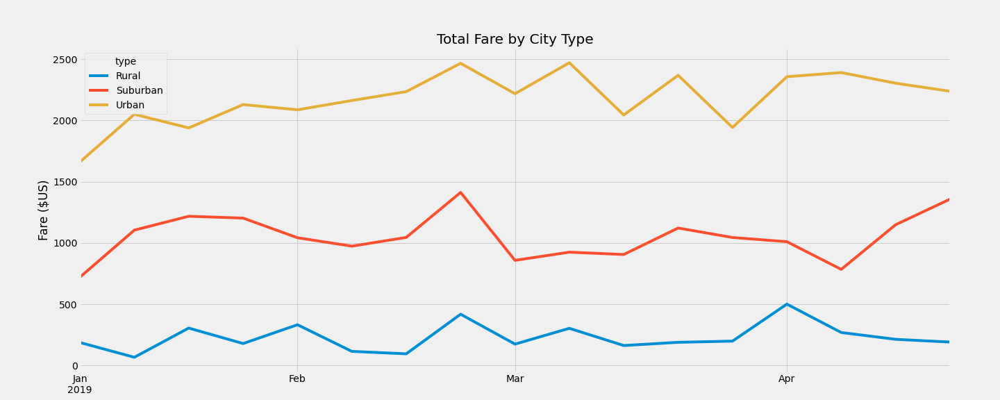

# PyBer_Analysis Challenge

## Our Task
For this assignment, we were tasked with summarizing ride share data by city type for our client and presenting a graphical representation of weekly fare data
by city type using Pandas and Matplotlib.  As corresponding analysis of the data was also requested by the client.

## Summary Data

Ride and fare data captured are summarized as follows:

There is a clear trend in the data that as you move away from rural settings, through suburban to urban, while there is a much hire volume of trips available,
the average fare per trip is signficantly reduced.  It would be interesting to study how much of this decrease is determined by the length of the trip or by the 
supply of drivers available for each setting.

